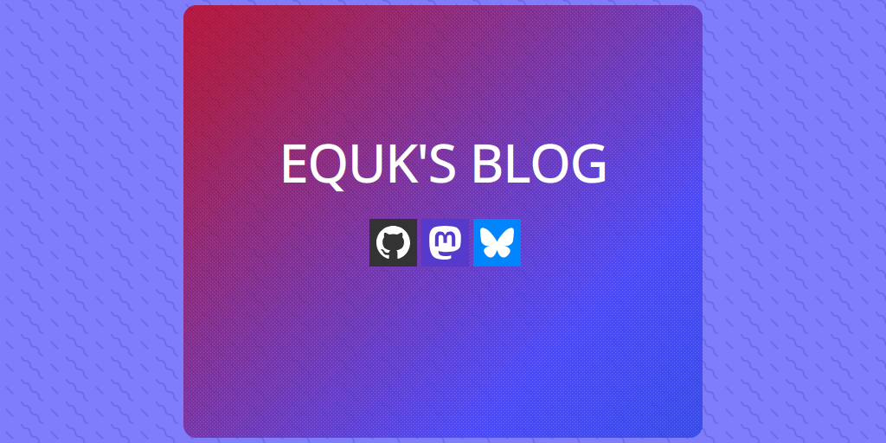
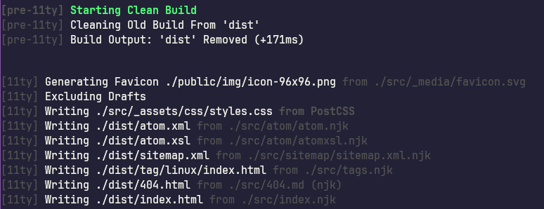

# 11ty-equk

Personal blog powered by 🎈 eleventy

Deployed at: https://equk.co.uk/

## ⚠️ not a starter template or theme

This is my own personal blog and shouldn't be used as a starter template or theme.

## Features

- [x] postcss integration
- [x] esbuild integration
- [x] image optimization
- [x] syntax highlighting (zero JS output)
- [x] atom feed generation
- [x] sitemap generation
- [x] post feature image
- [x] image attribution link
- [x] custom alert blocks in markdown
- [x] post list pagination
- [x] darkmode support (`localStorage` & `prefers-color-scheme`)
- [x] inlined css
- [x] opengraph meta tags
- [x] 11ty bundle support
- [x] markdown checklists
- [x] github alert blocks in markdown
- [x] prettier ruleset
- [x] favicon generation
- [x] social media interaction components
- [x] blog post interaction using mastodon & bluesky
- [x] esm support
- [x] external links automatically have `target` & `rel` added
- [x] oxlint for linting
- [x] data schema with type validation for posts
- [x] components using eleventy bundle for css & js

## Image Optimization

- [x] includes `` shortcode
- [x] automatic optimization in markdown
- [x] Automated `<picture>` syntax markup with srcset and optional sizes
- [x] Includes width/height attributes to avoid content layout shift
- [x] Includes `loading="lazy"` for native lazy loading without JavaScript
- [x] Includes `decoding="async"`

## URL Generation

Post permalinks are generated using `title` & `date` fields

Resulting in `/YYYY/MM/DD/slugify-title`

# Contact

Website: https://equk.co.uk

Mastodon: [@equilibriumuk@hachyderm.io](https://hachyderm.io/@equilibriumuk)

Bluesky: [@equilibriumuk.bsky.social](https://bsky.app/profile/equilibriumuk.bsky.social)

# License

Source Code: MIT License

Content & Media: Copyright

(You are **not** permitted to re-use the content publicly or commercially)

---

based on [eleventy-base-blog v8](https://github.com/11ty/eleventy-base-blog/tree/v8.0.0)
