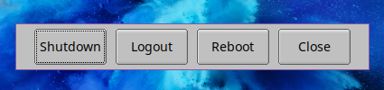
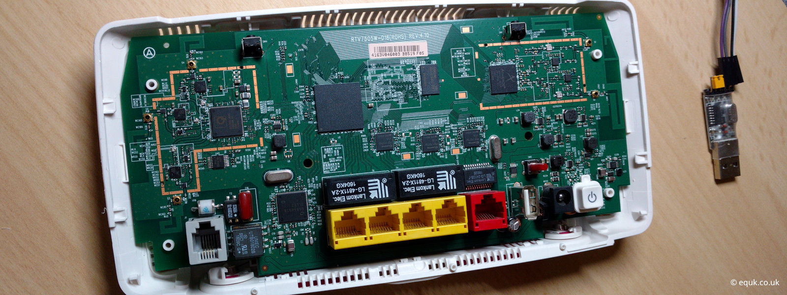

<i class="fa fa-microchip"></i> Hardware
<br/><i class="fa fa-code"></i> Software
<br/><i class="fa fa-github"></i> Opensource

<br/><i class="fa fa-code"></i> <i class="fa fa-github"></i> `postcss` integration with `11ty`
<br/><i class="fa fa-code"></i> <i class="fa fa-github"></i> `gatsby` integrated atom feed generation
<br/><i class="fa fa-code"></i> <i class="fa fa-github"></i> `nodejs` atom feed generation script
<br/><i class="fa fa-code"></i> <i class="fa fa-github"></i> windows `firefox` profile script rework (`userChrome` & `prefs`)
<br/><i class="fa fa-code"></i> <i class="fa fa-github"></i> linux `firefox` profile scripts (`userChrome` & `prefs`)
<br/><i class="fa fa-code"></i> <i class="fa fa-github"></i> unsplash_svkit - `sveltekit` image api search
<br/><i class="fa fa-code"></i> <i class="fa fa-github"></i> logout_rs - `rust` shutdown menu
<br/><i class="fa fa-code"></i> nftables attack logging (`prometheus` & `grafana`)
<br/><i class="fa fa-code"></i> nftables blocklist control
<br/><i class="fa fa-code"></i> <i class="fa fa-github"></i> cleanup-windows - windows 10 21H2 cleanup in `powershell`
<br/><i class="fa fa-code"></i> mailserver RBL lookup
<br/><i class="fa fa-code"></i> <i class="fa fa-github"></i> brave browser profiles
<br/><i class="fa fa-code"></i> <i class="fa fa-github"></i> unsplash json api search using `next.js`
<br/><i class="fa fa-code"></i> linux `wine` launcher with automatic `vulkan` acceleration
<br/><i class="fa fa-code"></i> linux `wine` game/app installer
<br/><i class="fa fa-code"></i> linux server monitoring daemon (golang `prometheus`)
<br/><i class="fa fa-code"></i> linux vps error reporting (golang `prometheus`)
<br/><i class="fa fa-code"></i> <i class="fa fa-github"></i> install firefox on windows 10 using `powershell`
<br/><i class="fa fa-code"></i> <i class="fa fa-github"></i> postscreen whitelist/blacklist using `spf`
<br/><i class="fa fa-code"></i> <i class="fa fa-github"></i> extract mailserver list from `spf`
<br/><i class="fa fa-code"></i> torbrowser update checker ( golang `net/http` )
<br/><i class="fa fa-code"></i> <i class="fa fa-github"></i> automated linux dotfiles
<br/><i class="fa fa-code"></i> <i class="fa fa-github"></i> gatsby new post cli in `nodejs` (no deps)
<br/><i class="fa fa-code"></i> <i class="fa fa-github"></i> use medium-zoom in `vuejs` & `nuxtjs`
<br/><i class="fa fa-code"></i> <i class="fa fa-github"></i> unsplash json api search using `react.js`
<br/><i class="fa fa-code"></i> golang api server using `net/http` & `chi`
<br/><i class="fa fa-code"></i> rust async server using `tokio`
<br/><i class="fa fa-code"></i> `QEMU` ARMv7 emulation in linux
<br/><i class="fa fa-code"></i> <i class="fa fa-github"></i> `osint` tool for inspecting tls for subdomains
<br/><i class="fa fa-code"></i> <i class="fa fa-github"></i> firefox profiles for windows using `powershell`
<br/><i class="fa fa-code"></i> <i class="fa fa-github"></i> firefox profile tools
<br/><i class="fa fa-code"></i> <i class="fa fa-github"></i> torjail - sandboxed torbrowser
<br/><i class="fa fa-code"></i> <i class="fa fa-github"></i> inspect http request headers using go `net/http`
<br/><i class="fa fa-code"></i> <i class="fa fa-github"></i> unsplash json api search using `vanilla javascript`
<br/><i class="fa fa-code"></i> <i class="fa fa-github"></i> linux audio device switcher with `ladspa` multiband eq
<br/><i class="fa fa-code"></i> <i class="fa fa-github"></i> nodejs api server template using `express`
<br/><i class="fa fa-code"></i> Chromium OS & Cloudready on `QEMU`
<br/><i class="fa fa-microchip"></i> <i class="fa fa-code"></i> BT HomeHub 5a `OpenWrt`
<br/><i class="fa fa-microchip"></i> <i class="fa fa-code"></i> Acer Chromebook C7/C710 `Coreboot`
<br/><i class="fa fa-microchip"></i> <i class="fa fa-code"></i> Android Testing Tools (ROM Patching)
<br/><i class="fa fa-microchip"></i> <i class="fa fa-code"></i> ARM64 Bootloader Testing (`U-Boot`)
<br/><i class="fa fa-microchip"></i> <i class="fa fa-code"></i> <i class="fa fa-github"></i> BlackWidow Macro Keys In Linux
<br/><i class="fa fa-code"></i> <i class="fa fa-github"></i> Cloudflare Iptables
<br/><i class="fa fa-microchip"></i> <i class="fa fa-code"></i> Netgear wnr2200 `OpenWrt` USB Patches & `extroot`
<br/><i class="fa fa-code"></i> <i class="fa fa-linux"></i> Mail Console
<br/><i class="fa fa-code"></i> <i class="fa fa-linux"></i> Mail CLI Admin Tools (`python` & `mysql`)
<br/><i class="fa fa-code"></i> <i class="fa fa-linux"></i> Archlinux package migration scripts
<br/><i class="fa fa-code"></i> <i class="fa fa-github"></i> Google Chrome Ramdisk Cache
<br/><i class="fa fa-code"></i> <i class="fa fa-github"></i> Windows Firewall Blocklists (`powershell`)
<br/><i class="fa fa-code"></i> <i class="fa fa-github"></i> Windows 10 Tweak Tools (`powershell`)
<br/><i class="fa fa-code"></i> <i class="fa fa-github"></i> Linux Logout GUI Using `python` `tkinter` (tk-logout)
<br/><i class="fa fa-code"></i> <i class="fa fa-github"></i> Web App Using `lastfm` API In `php` (lastfm-feed)
<br/><i class="fa fa-code"></i> <i class="fa fa-github"></i> Wordpress Security Modules
<br/><i class="fa fa-code"></i> <i class="fa fa-github"></i> Samsung i5700 Android dalvik-relocate
<br/><i class="fa fa-code"></i> <i class="fa fa-github"></i> Mac OSX Backup Script with Growl Notification
<br/><i class="fa fa-code"></i> <i class="fa fa-github"></i> Linux Backup with Notification
<br/><i class="fa fa-code"></i> Wordpress Picasa Gallery
<br/><i class="fa fa-code"></i> Wordpress Modules

<article class="message is-dark">
  <div class="message-header">
    <p><i class="fa-lg fa fa-github"></i> Github</p>
  </div>
  <div class="message-body">
    <p class="text-center">Opensource projects listed above can be found on my <a href="https://github.com/equk" target="_blank" aria-label="go to github" rel="noopener noreferrer">Github</a>.</p>
    <p class="text-center"><span class="language-color js"></span> Javascript <span class="language-color py"></span> Python <span class="language-color ts"></span> Typescript <span class="language-color php"></span> PHP <span class="language-color rust"></span> Rust <span class="language-color sh"></span> Bash <span class="language-color go"></span> Go <span class="language-color c"></span> C <span class="language-color ps"></span> Powershell</p>
  </div>
</article>

## Rust Logout Menu

Basic menu with shutdown options in linux.



Setup do be similar to the python <a href="/2014/06/07/tk_logout-python-script-for-i3wm/" target="_blank">tk_logout script</a> I made in 2014.

## Linux Wine Launcher

Allows automated installation of windows applications or games on linux by setting up a custom wine prefix/env with required libraries & features.

- [x] creates `WINEPREFIX` for each app
- [x] downloads & installs libraries (eg: `vulkan`)
- [x] per app configuration
- [x] optional features: `vulkan`, FPS overlay, RAM usage, logging
- [x] support for `WINEESYNC`
- [x] pre-defined installer for specific apps/games

Created as an alternative to GUI apps which have a lot of dependencies.<br/>
There are some GUI tools which do the same but are dependant on gnome-desktop & do not work on tiling window managers like i3.

## Unlocking Plusnet Hub One

<a href="/2022/04/11/unlocking-plusnet-hub-one/" target="_blank" rel="noopener noreferrer">



</a>

Hardware modifications to allow booting over serial connection.<br/>
Requires custom LEDE boot image to unlock `u-boot` bootloader to allow OpenWRT install.

## Postfix Postscreen Whitelist

CLI app to automate whitelisting (or blacklisting) of known email servers by iterating over `spf` records.

Built to work with domains that have email servers spanning over multiple `spf` lists.
<br/>*(see `google.com` example below)*
```
    └── google.com
        └── v=spf1 include:_spf.google.com
            └── v=spf1 include:_netblocks.google.com include:_netblocks2.google.com include:_netblocks3.google.com
```
App whitelists `IPV4` & `IPV6` ranges using `CIDR` blocks.

## Acer Chromebook C7/C710 Coreboot

Coreboot opensource firmware image, allowing the chromebook to boot into linux using different payloads eg: seabios, grub2, tianocore (UEFI).

<p class="text-center"></p>

Building coreboot is pretty easy, the instructions on the wiki are quite clear.<br/>
Just make sure you know what you are doing as you could brick your chromebook.

For more info on building coreboot [Building Coreboot in 2020](/2020/04/19/building-coreboot-2020)
