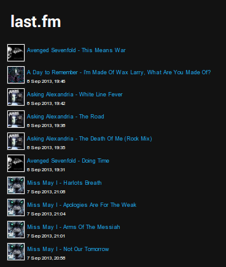

I just uploaded a new project to my github.

Some of the code is old but thought it would be worth uploading for other people to use.



It's been relesed under the GPL v3 License.

```php
    *****************************************************************
                    Lastfm feed - equk.co.uk
    *****************************************************************
     lastfm feed - Copyright (C) 2013  Bradley Walden
     This program comes with ABSOLUTELY NO WARRANTY.
     This is free software, and you are welcome to redistribute it
     under certain conditions. See GNU GPLv3.
    *****************************************************************

    To use this script you need to include this file using php.
    You can then call the functions.

    lastfmfeed('username','number_of_tracks')
```


Here is a <a title="lastfm feed php equk" href="https://github.com/equk/lastfm_feed" target="_blank">link to the project</a>
