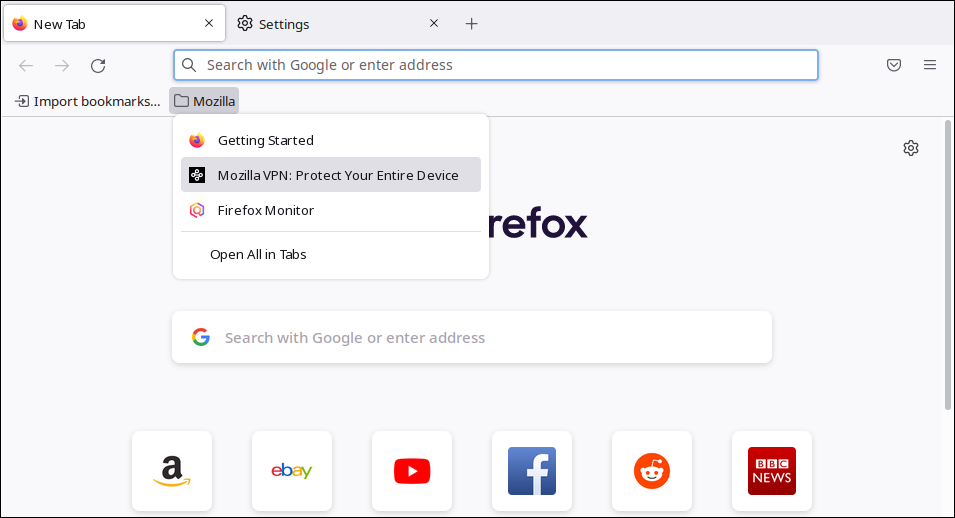

---
slug:
title: "Firefox in 2023"
date: 2023-03-29T13:33:04.976Z
draft: false
author: equilibriumuk
tags:
  - github
  - firefox
  - javascript
  - linux
image: ../_media/images/2018/09/mozilla_header.jpg
---

I decided to give Firefox a go after taking a break from using it.

There are still problems as I mentioned in <a href="/2021/09/13/dropping-firefox/" target="_blank">previous blog posts</a> but there are also workarounds with userChrome styles & custom user prefs.

## Default Look

The default look of Firefox still has huge negatives.

- [x] Tabs look like buttons from Google Bootstrap
- [x] Dropdowns are rounded
- [x] Huge spacing in menus
- [x] Pocket Recommended Adverts
- [x] Address Bar Adverts

Fortunately these things can be changed with overrides & preferences.

## Using Profile Script

I already have scripts setup for creating profiles with custom preferences & `userChrome.css` overrides (created in <a href="/2015/05/19/firefox-scripts/" target="_blank">2015</a>).

📝 <a href="/2018/09/12/firefox-profile-tools/" target="_blank">Sep 12, 2018 - Firefox Profile Tools</a>

<a class="github" href="https://github.com/equk/ffox_profile_tools" aria-label="View on GitHub" target="_blank" rel="noopener noreferrer"><i class="fa-brands fa-github"></i> ffox_profile_tools</a>

Creation of new profiles with:

- [x] Security & Privacy Related Settings Pre-Set
- [x] Find At Top Of Screen
- [x] RAM Caching Enabled
- [x] Sandbox Check (user namespaces kernel setting)
- [x] Auto Update Profile Preferences
- [x] Bookmark Bar Spacing
- [x] Disable Ugly `urlbar` Zoom (firefox >75)
- [x] Disable Ugly Drop Shadow On Search
- [x] Disable Search Suggestions
- [x] Disable Sponsored Suggestions

### Fixing The Look

I updated the custom userChrome styles.

- [x] Restore Old Square Tabs
- [x] Smaller Tab Density
- [x] Cleaner Image Context Menu
- [x] Smaller Bookmark Menu Spacing
- [x] No Rounded Edges in Dropdown Menu
- [x] Gtk Folder Icons

### userChrome Comparison

Here is a comparison to show the changes made with userChrome styles.

#### Firefox Default

#### Firefox userChrome Applied

## Notes

I am now using firefox as my main browser & it seems a lot more responsive than it did in 2021 when I switched to Brave.

The main reason I stopped using firefox was the constant changes to the UI. 
The default setup still has tabs that look like google bootstrap buttons so I can't really say anything has changed in that regard but with userChrome overrides it is at least usable now.

