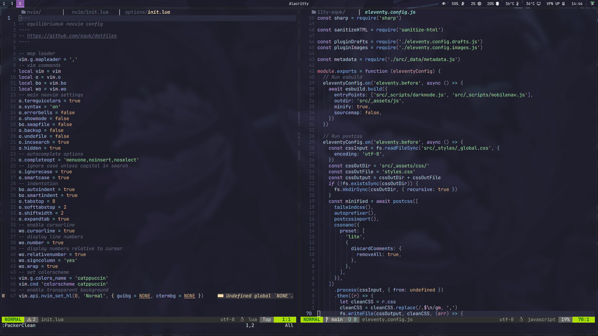

I made some basic scripts for capturing screenshots in `hyprland` using `grim` as `scrot` doesn't have support for wayland.

## Requirements

| App | Description |
|-|-|
| <a href="https://github.com/emersion/grim" target="_blank" rel="noopener noreferrer">Grim</a> | Screenshot utility for Wayland |
| <a href="https://github.com/emersion/slurp" target="_blank" rel="noopener noreferrer">Slurp</a> | Select a region in a Wayland compositor |
| <a href="https://hyprland.org/" target="_blank" rel="noopener noreferrer">Hyprland</a> | Dynamic tiling Wayland compositor based on wlroots |
| <a href="https://stedolan.github.io/jq/" target="_blank" rel="noopener noreferrer">jq</a> | Command-line JSON processor |

## Scripts

I made 3 scripts which all save screenshots in the same directory using the current date & time to provide a unique name. 
The scripts save to `$HOME/Pictures/screenshots/` with unique filename `dd-mm-YYYY-HHSS`.

| Script | Description |
|-|-|
| screenshot | capture active monitor |
| screenactive | capture active window |
| screenselect | capture selection |

These scripts are available in the `bin` directory in my `dotfiles` repo on github.

<a class="github" href="https://github.com/equk/dotfiles/tree/master/configs/bin" aria-label="View on GitHub" target="_blank" rel="noopener noreferrer"><i class="fa-brands fa-github"></i> dotfiles/config/bin</a>

### Using hyprctl

hyprland has a utility (`hyprctl`) which allows a user to get information & give a json output.

<blockquote>

hyprctl is a utility for controlling some parts of the compositor from a CLI or a script
 
<cite><i class="fa-solid fa-link"></i> <a href="https://wiki.hyprland.org/Configuring/Using-hyprctl/" target="_blank" rel="noopener noreferrer">Hyprland Wiki - Using hyprctl</a></cite>
</blockquote>

I am using this with `jq` in the scripts to get the active monitor & active window.

## Source

The source for my hyprland config is available in my dotfiles repo on github.

<a class="github" href="https://github.com/equk/dotfiles" aria-label="View on GitHub" target="_blank" rel="noopener noreferrer"><i class="fa-brands fa-github"></i> dotfiles</a>